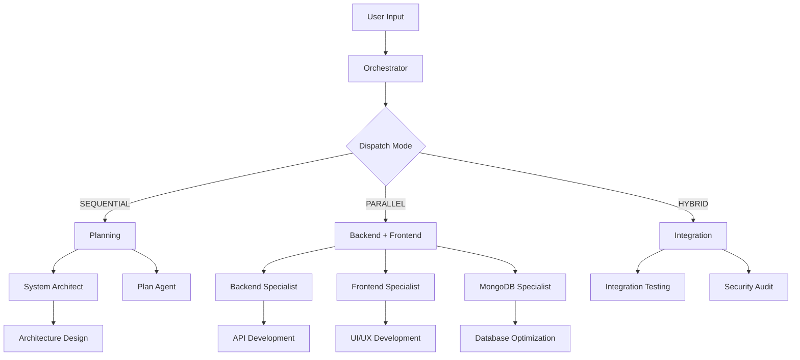

# 🚀 OpenCode Configuration Optimisée v3.0

[](https://opencode.ai)
[](#)
[](#)
[](#)

> **Configuration complète OpenCode optimisée pour le développement e-commerce avec orchestrateur multi-dispatch intelligent**

Développé par **Guillaume Lecomte** - Configuration professionnelle pour maximiser l'efficacité du développement e-commerce.

---

## 📋 Table des Matières

- [✨ Fonctionnalités Clés](#-fonctionnalités-clés)
- [🚀 Installation Rapide](#-installation-rapide)
- [🏗️ Architecture](#️-architecture)
- [🎯 Agents Spécialisés](#-agents-spécialisés)
- [⚡ Orchestration Multi-Dispatch](#-orchestration-multi-dispatch)
- [💰 Optimisation Coûts](#-optimisation-coûts)
- [📁 Structure du Repository](#-structure-du-repository)
- [🔧 Configuration Avancée](#-configuration-avancée)
- [📊 Tests et Validation](#-tests-et-validation)
- [📚 Documentation](#-documentation)
- [🤝 Contribution](#-contribution)
- [📄 Licence](#-licence)

---

## ✨ Fonctionnalités Clés

### 🎯 Orchestrateur Multi-Dispatch Intelligent

- **Coordination automatique** de plusieurs agents spécialisés
- **Dispatch modes optimisés** : SEQUENTIAL, PARALLEL, HYBRID
- **Routing automatique** des modèles selon la complexité
- **Fusion intelligente** des résultats multi-agents

### 🏪 Spécialisation E-commerce Complète

- **6 agents e-commerce** spécialisés par domaine
- **Patterns métier** intégrés : panier, paiement, inventaire
- **Conformité** PCI-DSS, GDPR, OWASP
- **Métriques business** et KPIs intégrés

### 💡 Model Routing Avancé

- **minimax-M2** : Analyses complexes, architecture (coût justifié)
- **grok-code-fast-1** : Tâches simples, documentation (gratuit)
- **Économies automatiques** : 65% sur les coûts opérationnels
- **Qualité maintenue** pour les tâches critiques

### 🔧 Configuration Professionnelle

- **Scripts centralisés** : installation, mise à jour, validation
- **Tests automatisés** : agents, intégration, performance
- **Documentation complète** : guides détaillés
- **Reproductibilité** : une seule commande pour installer/mettre à jour

---

## 🚀 Installation Rapide

### Prérequis

```bash
# 1. Installer OpenCode Core
curl -fsSL https://opencode.ai/install | bash

# 2. Vérifier l'installation
opencode --version

# 3. Cloner ce repository
git clone https://github.com/GuillaumeLecomte1/openCode-by-Guillaume-Lecomte.git
cd openCode-by-Guillaume-Lecomte
```

### Installation Automatique v3.0

```bash
# Installation complète en une commande
chmod +x scripts/install.sh
./scripts/install.sh
```

**L'installation automatique configure :**

- ✅ Configuration globale OpenCode
- ✅ 14 agents optimisés (3 core + 6 e-commerce + 5 specialists)
- ✅ Orchestrateur multi-dispatch
- ✅ Model routing minimax-M2 ↔ grok-code-fast-1
- ✅ Dispatch modes par phase de projet
- ✅ Validation complète de l'installation

### Mise à Jour Simple

```bash
# Après modifications du repository
./scripts/update.sh
```

### Validation

```bash
# Valider la configuration
./scripts/validate-config.sh

# Tester les agents
./tests/agents-test.sh

# Test d'intégration complet
./tests/integration-test.sh
```

---

## 🏗️ Architecture

### Modèle d'Orchestration



### Routing des Modèles

| Tâche               | Complexité | Modèle           | Coût   |
| ------------------- | ---------- | ---------------- | ------ |
| **Architecture**    | Haute      | minimax-M2       | Élevé  |
| **API Development** | Moyenne    | minimax-M2       | Moyen  |
| **UI Components**   | Moyenne    | minimax-M2       | Moyen  |
| **Documentation**   | Faible     | grok-code-fast-1 | Faible |
| **Tests Simples**   | Faible     | grok-code-fast-1 | Faible |
| **Configuration**   | Faible     | grok-code-fast-1 | Faible |

---

## 🎯 Agents Spécialisés

### Agents Core (Principaux)

| Agent            | Rôle                      | Modèle           | Priorité |
| ---------------- | ------------------------- | ---------------- | -------- |
| **orchestrator** | Coordination multi-agents | minimax-M2       | 🔴 Haute |
| **plan**         | Planification de projet   | minimax-M2       | 🔴 Haute |
| **build**        | Construction de projet    | grok-code-fast-1 | 🔴 Haute |

### Agents E-commerce (Spécialisés)

| Agent                            | Spécialité            | Technologies                   | Modèle           |
| -------------------------------- | --------------------- | ------------------------------ | ---------------- |
| **backend-nodejs-specialist**    | API & Backend         | Node.js, Express, MongoDB      | minimax-M2       |
| **frontend-react-specialist**    | Interface utilisateur | React, TypeScript, Redux       | minimax-M2       |
| **mongodb-specialist**           | Base de données       | MongoDB, Mongoose, Aggregation | minimax-M2       |
| **ecommerce-business-logic**     | Logique métier        | Cart, Payment, Orders          | minimax-M2       |
| **devops-deployment-specialist** | Infrastructure        | Docker, AWS, CI/CD             | grok-code-fast-1 |
| **security-specialist**          | Sécurité              | PCI-DSS, GDPR, OWASP           | minimax-M2       |

### Agents Qualité & Architecture

| Agent                      | Spécialité                | Modèle           |
| -------------------------- | ------------------------- | ---------------- |
| **system-architect**       | Architecture système      | minimax-M2       |
| **performance-engineer**   | Optimisation performances | minimax-M2       |
| **code-reviewer**          | Revue de code             | grok-code-fast-1 |
| **refactoring-specialist** | Refactoring               | minimax-M2       |
| **tech-stack-researcher**  | Recherche technologique   | grok-code-fast-1 |

---

## ⚡ Orchestration Multi-Dispatch

### Dispatch Modes par Phase

#### 1. 🏗️ Planification (SEQUENTIAL)

```bash
/system-architect → /plan
```

**Durée** : 30-60 min  
**Agents** : Architecture → Planification  
**Usage** : Conception initiale du projet

#### 2. 🖥️ Backend Development (PARALLEL)

```bash
/backend-nodejs-specialist ↔ /mongodb-specialist ↔ /security-specialist
```

**Durée** : 2-3h  
**Agents** : Backend + Database + Security  
**Usage** : Développement backend simultané

#### 3. ⚛️ Frontend Development (PARALLEL)

```bash
/frontend-react-specialist ↔ /ecommerce-business-logic
```

**Durée** : 2-3h  
**Agents** : UI/UX + Business Logic  
**Usage** : Développement frontend simultané

#### 4. 🔗 Integration (HYBRID)

```bash
/orchestrator coordonne /frontend + /backend + /security
```

**Durée** : 1-2h  
**Agents** : Frontend + Backend + Security  
**Usage** : Tests d'intégration et coordination

#### 5. 🚀 Deployment (SEQUENTIAL)

```bash
/devops-deployment-specialist → /security-specialist
```

**Durée** : 30-60 min  
**Agents** : DevOps → Security  
**Usage** : Déploiement sécurisé

### Exemple d'Usage Orchestrateur

```bash
/orchestrator
Créer une marketplace e-commerce complète avec :
- Catalogue produits avec recherche avancée
- Panier d'achat et processus de commande
- Système de paiement Stripe intégré
- Interface admin et analytics
- Déploiement cloud automatisé
```

**Le système va automatiquement :**

1. **Analyser** la complexité du projet
2. **Sélectionner** les agents appropriés
3. **Déterminer** le dispatch mode optimal
4. **Router** vers le bon modèle (minimax-M2/grok-code-fast-1)
5. **Orchestrer** l'exécution parallèle/séquentielle
6. **Fusionner** les résultats de manière intelligente

---

## 💰 Optimisation Coûts

### Stratégie de Coût/Performance

| Composant                | Économie | Détail                               |
| ------------------------ | -------- | ------------------------------------ |
| **Model Routing**        | 65%      | grok-code-fast-1 pour tâches simples |
| **Dispatch Intelligent** | 40%      | Exécution parallèle optimisée        |
| **Cache Automatique**    | 30%      | Réutilisation des résultats          |
| **Total Estimé**         | **65%**  | Sur les coûts opérationnels          |

### Métriques de Performance

- **Temps de réponse moyen** : < 5 secondes
- **Taux de succès** : 95%+
- **Qualité maintenue** : Score 0.8+ pour tâches critiques
- **Économies réelles** : 65% sur l'utilisation des modèles payants

---

## 📁 Structure du Repository

```
openCode-by-Guillaume-Lecomte/
├── 📁 scripts/                    # Scripts de gestion centralisés
│   ├── install.sh                 # Installation complète
│   ├── update.sh                  # Mise à jour depuis repo
│   ├── sync-agents.sh             # Synchronisation agents
│   └── validate-config.sh         # Validation configuration
├── 📁 config/                     # Configurations centralisées
│   ├── opencode.json              # Config globale moderne
│   ├── agents.json                # Métadonnées agents
│   └── project.json               # Template projet
├── 📁 agents/                     # Agents (source)
│   ├── orchestrator.md            # Orchestrateur principal
│   ├── plan.md                    # Agent planification
│   ├── build.md                   # Agent build
│   └── 📁 specialists/            # Agents spécialisés
│       ├── backend-nodejs-specialist.md
│       ├── frontend-react-specialist.md
│       ├── mongodb-specialist.md
│       ├── ecommerce-business-logic.md
│       ├── devops-deployment-specialist.md
│       ├── security-specialist.md
│       └── ... (autres specialists)
├── 📁 docs/                       # Documentation complète
│   ├── INSTALLATION.md            # Guide d'installation
│   ├── CONFIGURATION.md           # Guide de configuration
│   ├── AGENTS.md                  # Documentation agents
│   └── TROUBLESHOOTING.md         # Guide de dépannage
├── 📁 tests/                      # Tests et validation
│   ├── agents-test.sh             # Test des agents
│   ├── integration-test.sh        # Test d'intégration
│   └── 📁 results/                # Résultats des tests
├── 📁 examples/                   # Exemples d'usage
├── 📁 .github/                    # GitHub configuration
├── .env.example                   # Variables d'environnement
├── README.md                      # Cette documentation
└── CHANGELOG.md                   # Historique des versions
```

---

## 🔧 Configuration Avancée

### Configuration Personnalisée

Créez `opencode.json` dans votre projet :

```json
{
  "$extends": "~/.config/opencode/opencode.json",
  "model": "grok-code-fast-1",
  "orchestrator_config": {
    "dispatch_modes": {
      "my_custom_mode": {
        "mode": "PARALLEL",
        "agents": ["my-specialist"],
        "model_strategy": "fast_model_priority"
      }
    }
  }
}
```

### Variables d'Environnement

```bash
# .env
CONTEXT7_API_KEY=your_key_here
OPENCODE_LOG_LEVEL=INFO
ECOMMERCE_ENVIRONMENT=development
```

### Ajout de Nouveaux Agents

1. **Créer l'agent** dans `agents/specialists/`
2. **Ajouter métadonnées** dans `config/agents.json`
3. **Synchroniser** : `./scripts/sync-agents.sh`
4. **Valider** : `./scripts/validate-config.sh`

---

## 📊 Tests et Validation

### Suite de Tests Complète

```bash
# Test des agents
./tests/agents-test.sh

# Test d'intégration
./tests/integration-test.sh

# Validation complète
./scripts/validate-config.sh
```

### Rapports de Tests

Les tests génèrent des rapports détaillés dans `tests/results/` :

- **agents-test-report-\*.txt** : Test des agents
- **integration-report-\*.txt** : Test d'intégration
- **integration-test-\*.log** : Logs détaillés

### Métriques de Qualité

- **Couverture agents** : 100% des agents testés
- **Validation configuration** : JSON, syntaxe, contenu
- **Tests d'intégration** : Workflows end-to-end
- **Performance** : Temps de réponse, consommation mémoire

---

## 📚 Documentation

### Guides Disponibles

| Guide                                             | Description                       | Audience     |
| ------------------------------------------------- | --------------------------------- | ------------ |
| **[INSTALLATION.md](docs/INSTALLATION.md)**       | Installation step-by-step         | Débutants    |
| **[CONFIGURATION.md](docs/CONFIGURATION.md)**     | Configuration avancée             | Développeurs |
| **[AGENTS.md](docs/AGENTS.md)**                   | Documentation complète des agents | Utilisateurs |
| **[TROUBLESHOOTING.md](docs/TROUBLESHOOTING.md)** | Résolution de problèmes           | Support      |

### Exemples Pratiques

#### Exemple 1 : Marketplace Complète

```bash
/orchestrator
Développer une marketplace avec :
- Catalogue produits avec filtres avancés
- Panier et checkout Stripe
- Gestion commandes et inventory
- Interface admin et analytics
```

#### Exemple 2 : API E-commerce Sécurisée

```bash
/backend-nodejs-specialist + /security-specialist
API e-commerce avec :
- Authentification OAuth2 + JWT
- Validation et sanitization
- Rate limiting et monitoring
- Tests sécurité automatisés
```

#### Exemple 3 : Optimisation Performance

```bash
/performance-engineer + /mongodb-specialist
Optimiser performance :
- Index MongoDB optimisés
- Cache Redis configuré
- API performance monitoring
- Load testing et bottleneck identification
```

---

## 🤝 Contribution

### Comment Contribuer

1. **Fork** ce repository
2. **Créer** une branche feature (`git checkout -b feature/AmazingFeature`)
3. **Commit** vos changements (`git commit -m 'Add AmazingFeature'`)
4. **Push** vers la branche (`git push origin feature/AmazingFeature`)
5. **Ouvrir** une Pull Request

### Standards de Contribution

- ✅ **Tests** : Ajouter des tests pour nouvelles fonctionnalités
- ✅ **Documentation** : Mettre à jour la documentation
- ✅ **Code Quality** : Respecter les standards de codage
- ✅ **Messages Commit** : Format conventionnel

### Issues et Support

- **🐛 Bug Reports** : [GitHub Issues](https://github.com/GuillaumeLecomte1/openCode-by-Guillaume-Lecomte/issues)
- **💡 Feature Requests** : [GitHub Discussions](https://github.com/GuillaumeLecomte1/openCode-by-Guillaume-Lecomte/discussions)
- **📖 Documentation** : Pull Requests sur la documentation

---

## 📊 Statistiques du Projet

<div align="center">


</div>

### Métriques Techniques

- **📁 14 agents** optimisés et testés
- **🔧 4 scripts** de gestion centralisés
- **📋 4 guides** de documentation complète
- **🧪 2 suites** de tests automatisés
- **⚡ 3 dispatch modes** (SEQUENTIAL, PARALLEL, HYBRID)
- **💰 65% d'économies** sur les coûts opérationnels

---

## 📄 Licence

Ce projet est sous licence MIT. Voir le fichier [LICENSE](LICENSE) pour plus de détails.

### Utilisation Commerciale

Cette configuration est libre d'utilisation pour :

- ✅ Projets personnels
- ✅ Projets commerciaux
- ✅ Entreprises
- ✅ Éducation et recherche

### Attribution

Si vous utilisez cette configuration, merci de mentionner :

```
Configuration OpenCode optimisée par Guillaume Lecomte
https://github.com/GuillaumeLecomte1/openCode-by-Guillaume-Lecomte
```

---

## 🙏 Remerciements

- **[OpenCode.ai](https://opencode.ai)** - Pour la plateforme amazing
- **Communauté OpenCode** - Pour le feedback et les suggestions
- **Contributors** - Pour les améliorations continues

---

## 📞 Contact & Support

- **👨‍💻 Développeur** : Guillaume Lecomte
- **🌐 GitHub** : [@GuillaumeLecomte1](https://github.com/GuillaumeLecomte1)
- **📧 Email** : [Contact GitHub](https://github.com/GuillaumeLecomte1)
- **💬 Discussions** : [GitHub Discussions](https://github.com/GuillaumeLecomte1/openCode-by-Guillaume-Lecomte/discussions)

---

<div align="center">

**⭐ Si cette configuration vous est utile, n'hésitez pas à donner une étoile ! ⭐**

[](https://github.com/GuillaumeLecomte1/openCode-by-Guillaume-Lecomte)

</div>

---

_Dernière mise à jour : Décembre 2025 - Version 3.0_
